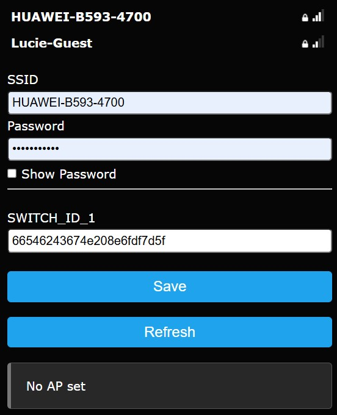

# Sinric_pro
## Purpose 
This program runs on an ESP8266 to follow a SinricPro switch state. SinricPro switch state is controlled by Google Assistantor Alexa or other.

## Captive portal
Without known wifi, the captive portal is started.

AP SSID: 'Sinric', times out after 90 seconds
AP IP: 192.0.4.1

Sinric API has:
- APP_KEY:                  hardcoded in secrets.h
- APP_SECRET:               hardcoded in secrets.h
- SINRIC_PRO_SWITCH_KEY:    via captive portal

via captive portal, fill in:
- WIFI SSID
- WIFI PASS
- SINRIC_PRO_SWITCH_KEY

## Status led

Following LED status are defined:
- At start-up: steady lit
- after Wifi and Sinric PRO connect:    blinking
- whenswitch off command received:      steady OFF
- whenswitch on command received:       steady ON

## Versions
Only tested on 8266 Wemos.

### 0.2.1 OTA version

Sinric SDK 3.3.1 with OTA support
Firmware with OTA-Support
firmware_0.2.1.bin

### 0.01 First version

Sinric Switch
WifiManager
StatusLED

## Screenshots

## Links

https://sinric.pro
https://help.sinric.pro/pages/ota
https://github.com/sinricpro/esp8266-esp32-sdk/tree/master/examples/OTAUpdate